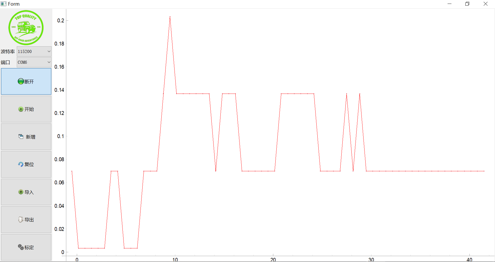

# serialPlotter

This is GUI base on **PyQt5** and **pyserial**, which show the curv data from COM ports.

## Usage

ALL of the **.py** and **resource** folder are necessarry to run the script  
The **import** file must be **.csv** expoted from **export** function with this script  

## GUI

## Functions
Nothing of note

