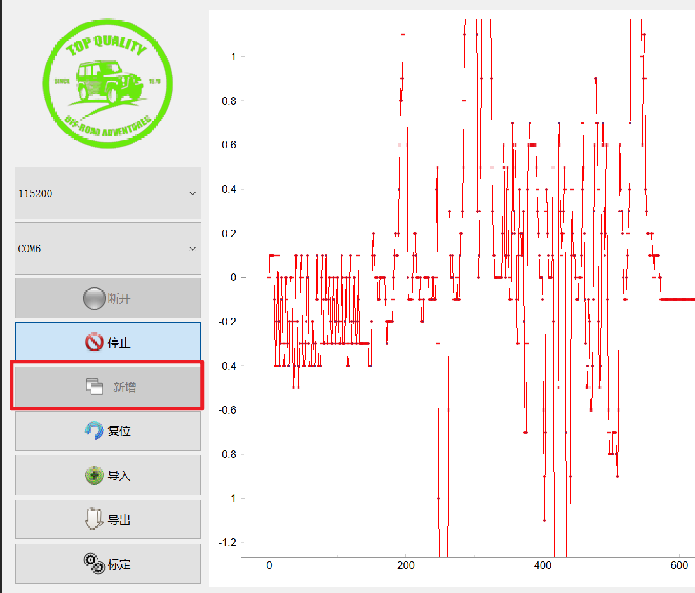
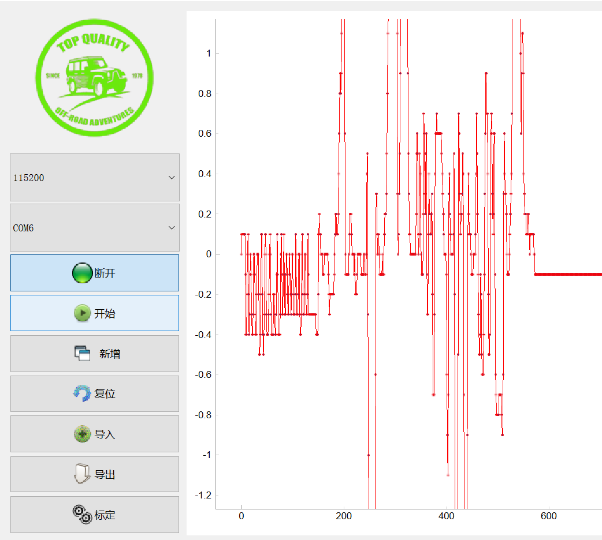
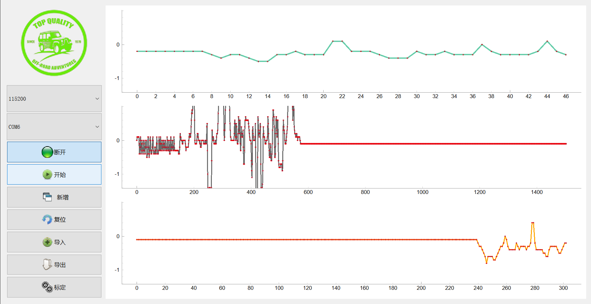

# serialPlotter

This is GUI base on **PyQt5** and **pyserial**, which show the curv data from COM ports.

## Usage

ALL of the **.py** and **resource** folder are necessarry to run the script  
The **import** file must be **.csv** expoted from **export** function with this script  

## GUI

## Functions
### 使用需知
#### 1、先点击“停止”按钮，然后才能执行“断开”或“新增”操作：

#### 2、点击“复位”按钮后，会清楚之前的数据，按照新接收的数据并自动开始绘图
#### 3、点击“导出”按钮，如果选择导出表格（csv）数据，那么数据来源是**当前**正在接收的动态数据的集合

